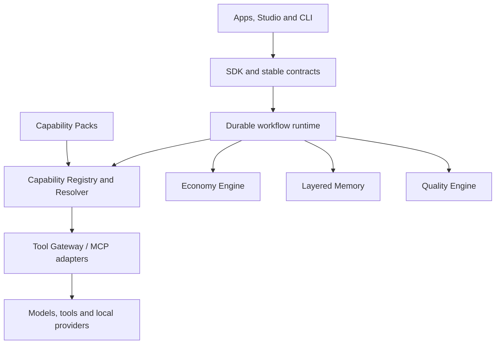

# REXO

**Runtime for Execution & eXchange Orchestration**

REXO is an experimental, capability-first runtime for building reusable AI
systems. It treats models, tools, memory, workflows, budgets, and quality gates
as governed infrastructure instead of hiding them inside large prompts.

> Project status: public foundation (`v0.0.1`). The CLI is functional; the AI
> runtime is not implemented yet.

[Português do Brasil](README.pt-BR.md) ·
[Install](INSTALL.md) ·
[Architecture](docs/architecture/constitution.md) ·
[Roadmap](docs/roadmap/core-v1.md) ·
[Getting started](docs/getting-started/README.md)

## What works today

- `rexo version` reports the build and target platform.
- `rexo doctor` verifies basic machine compatibility.
- `rexo init <directory>` creates a portable project with a manifest,
  layered-memory structure, budget, quality policy, and agent bootstrap.
- CI validates the same source on Windows, macOS, and Linux.
- Releases are designed as standalone binaries with no required Python, Node,
  Docker, or LLM account.

## Why REXO

Most agent systems start with named agents and grow into tightly coupled prompt
collections. REXO starts with **capabilities**. Workflows request an outcome;
the runtime selects an eligible provider according to policy, quality, cost,
latency, availability, and cache state.



## Build from source

Requirements: Go 1.24 or later and Git.

```shell
go test ./...
go build -o rexo ./cmd/rexo
./rexo doctor
./rexo init my-first-project
```

On Windows, the generated executable is `rexo.exe`.

## Core principles

1. Capability-first, not agent-first.
2. Minimum necessary context for every task.
3. Disposable workers and durable artifacts.
4. Reuse and cache before generation.
5. The smallest adequate model for each operation.
6. Explicit budgets for tokens, calls, time, and cost.
7. Quality floors, bounded retries, and deterministic fallbacks.
8. Packs extend the platform without modifying Core.
9. Observable, versioned, and reproducible execution.
10. Architecture grows only for real, recurring, measurable problems.

## Scope discipline

The first vertical validation will be an Education Pack:

`briefing → research reuse → curriculum → lesson plan → script → PDF → QA → course package`

Marketplace, Studio, Canvas, Creator, distributed execution, and autonomous
self-modification are intentionally outside the current implementation phase.

## License

Apache License 2.0. See [LICENSE](LICENSE).

The name REXO has passed only a preliminary collision search. It has not yet
received formal legal or trademark clearance.
