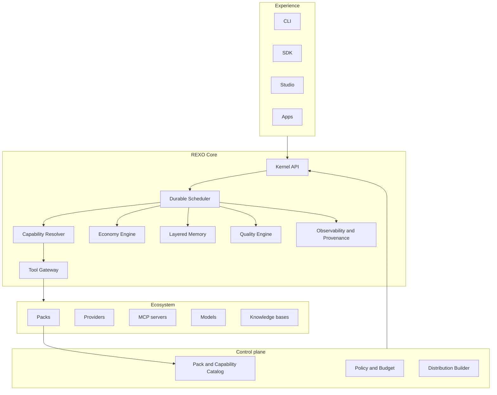
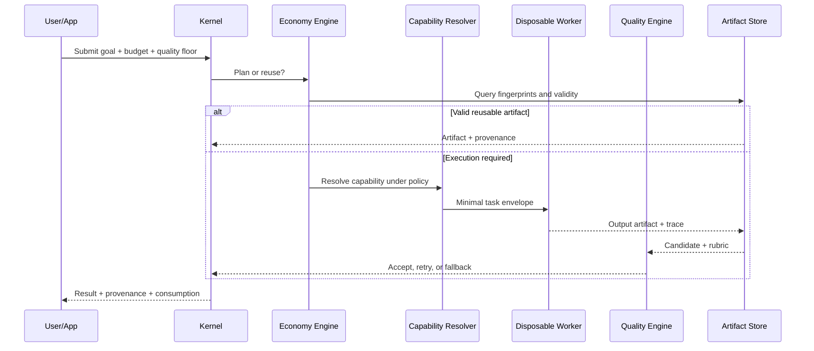

# REXO Core v1 — Architectural Constitution

Status: frozen for implementation

Scope: Core v1

Historical codename: AIOS

The human-oriented specification is preserved as
[`REXO_Constituicao_Arquitetural_v3.0_PT-BR.pdf`](REXO_Constituicao_Arquitetural_v3.0_PT-BR.pdf)
(Portuguese) and its English translation
[`REXO_Architectural_Constitution_v3.0_EN.pdf`](REXO_Architectural_Constitution_v3.0_EN.pdf).
The earlier v2.0 draft, [`AIOS_Constituicao_Arquitetural_v2.0.pdf`](AIOS_Constituicao_Arquitetural_v2.0.pdf),
predates the REXO rename and is kept only for traceability. This Markdown
constitution is authoritative when any PDF snapshot or older proposal
conflicts with the frozen Core.

## 1. Mission

REXO is a platform for creating specialized AI platforms. Its stable core
governs execution, capabilities, tools, context, memory, cost, quality, and
provenance. Domain behavior arrives through installable packs.

The system is not a chatbot, a prompt collection, or an attempt to reproduce a
general-purpose hardware operating system. “OS” is a product metaphor for a
governed runtime and ecosystem.

## 2. Architectural model

## 3. Frozen invariants

### 3.1 Capability-first

Workflows request capabilities such as `research.collect` or `document.render`.
They do not bind themselves to a named agent, model, vendor, or MCP server.

### 3.2 Disposable workers

A worker receives only:

- task objective;
- required inputs and artifacts;
- relevant memory;
- execution budget;
- success criteria.

Its conversational context is destroyed after completion. Only outputs,
structured traces, evaluation results, and selected lessons may persist.

### 3.3 Durable workflows

Workflow state survives process interruption. Every step is idempotent where
possible and records its input fingerprint, output artifact, provider,
contract version, policy decision, and evaluation.

### 3.4 Tool Gateway

Core code never depends directly on a tool protocol or vendor. MCP is an
important adapter family, not the internal domain model.

### 3.5 Layered memory

Memory is separated into:

- global: stable, cross-project knowledge approved for reuse;
- project: decisions, vocabulary, constraints, and curated knowledge;
- execution: temporary state shared by one workflow run;
- task: the minimum context for one worker.

Access is least-privilege. Runtime transcripts are not automatically promoted
to durable memory.

### 3.6 Economy Engine

Before any paid or probabilistic operation, the runtime evaluates:

1. whether a valid artifact already exists;
2. whether an incremental rebuild is possible;
3. the minimum context required;
4. the smallest adequate provider/model;
5. remaining token, call, time, and cost budgets;
6. expected quality and fallback path.

### 3.7 Quality floor

Cost optimization may not cross the declared minimum quality. Evaluators use
versioned criteria. Retries are bounded, and every loop has an acceptance
threshold and fallback.

### 3.8 Packs do not modify Core

A pack contributes manifests, capabilities, providers, workflows, templates,
policies, evaluators, knowledge descriptors, and applications through public
contracts. Installing a pack must not patch Core source.

### 3.9 Version everything executable

Capabilities, workflows, providers, schemas, policies, templates, evaluators,
packs, distributions, and artifacts have explicit versions and compatibility
rules.

### 3.10 Controlled evolution

Architecture changes require:

- a real, recurring, measurable problem;
- evidence that existing extension points cannot solve it;
- an ADR;
- migration and rollback strategy;
- tests protecting the new boundary.

## 4. Execution contract

## 5. Public contract families

- Project Manifest
- Capability Manifest
- Provider Manifest
- Workflow Definition
- Task Envelope
- Artifact Manifest
- Evaluation Report
- Pack Manifest
- Distribution Manifest
- Execution Trace

JSON Schema is the initial interchange format. Language SDKs are generated or
implemented against those contracts.

## 6. Security boundaries

- Secrets are referenced, never embedded in manifests or artifacts.
- Packs are untrusted until verified.
- Tool access is policy-gated per task.
- Provider output is untrusted input.
- External writes require explicit authority and auditable provenance.
- Cache keys must include policy-relevant inputs to prevent unsafe reuse.
- Sensitive data cannot be promoted from project memory to global memory
  without deliberate review.

## 7. Context-efficiency requirements

Every run records tokens, calls, model/provider, wall time, estimated cost,
cache hits, cache misses, retries, and artifact reuse. Optimization is based on
measured waste, not intuition.

After a project, repeated patterns may propose a new skill, template, cache
rule, evaluator, or pipeline. Proposals do not self-install or modify Core
without review.

## 8. Deliberately deferred

Core v1 does not require multi-region scheduling, Kubernetes, blockchain,
general autonomous self-modification, a public marketplace, a visual Studio,
or hundreds of simultaneous agents. Contracts must permit later scale, but the
MVP will validate them locally with one user and one reference vertical.
